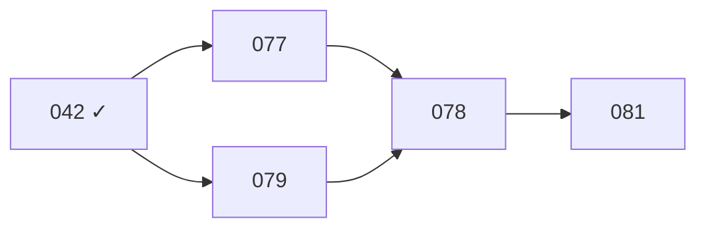

# Estado del Proyecto

> Dashboard rápido del ecosistema de templates. Úsalo al inicio de una sesión para entender el estado actual.

---

## Paso 1: Actividad Git

Mostrar actividad reciente del repositorio:

- **Últimos 5 commits**: `git log --oneline -5`
- **Cambios sin commitear**: `git status --short` filtrado a archivos de template (`.md`, `.mdc`)
- **Rama actual**: confirmar en `main`

Presentar como:

```markdown
## Actividad Reciente
| Commit | Mensaje |
|--------|---------|
| abc1234 | optimize: reducir task_template en 35% |
| ... | ... |

**Sin commitear:** N archivos modificados, M sin seguimiento
```

---

## Paso 2: Conteo de Templates

Contar archivos en cada ubicación:

### Templates de Producción

| Ubicación | Contenido | Esperado |
|-----------|-----------|----------|
| `commands/` | Templates de planificación por stack + setup + testing + sync | 14 |
| `skills/` | Workflows operacionales + coding guides (folder/SKILL.md) | 27 |
| `agents/` | Subagents (task-planner, reviewer, adk, implementer, doc-syncer, researcher, orientador, git-guardian) | 8 |
| `CLAUDE.md.template` | Template base CLAUDE.md (5 secciones transversales) | 1 |
| **Total** | | **50** |

> Hooks deployables (`hooks/`) NO cuentan como templates — son artefactos opt-in paralelos.

### Otros Recursos

| Ubicación | Tipo | Contar |
|-----------|------|--------|
| `.cursor/rules/` | Reglas Cursor IDE | N archivos .mdc |
| `.claude/commands/` | Meta-comandos | N archivos .md |
| `.claude/agents/` | Meta-agentes | N archivos .md |

---

## Paso 3: Tareas y Trabajo Pendiente

- **Tareas recientes**: Listar últimos 5 archivos en `ai_docs/tasks/` por nombre
- **Estado general**: Indicar si hay trabajo en progreso

Presentar como:

```markdown
## Tareas Recientes
- 035_SYNC_ADK_TEMPLATE_ES.md
- 034_improve_templates_batch.md
- ...

## Estado General
- Tareas activas: N
- Última tarea: NNN
```

---

## Paso 3.5: Vista DAG (condicional)

> Solo se ejecuta si alguna tarea ABIERTA o EN_PROGRESO en `ai_docs/tasks/` tiene `> **Depende de:**` declarado en su cabecera. Absorbe la idea de un `/dependency-graph` separado — único punto de overview del backlog.

1. Extraer dependencias declaradas: `grep -rn "^>.*\*\*Depende de:\*\*" ai_docs/tasks/`.
2. Construir grafo: nodo = task ID, arista = "X depende de Y" → flecha Y→X.
3. Renderizar Mermaid:



Marcas: ✓ COMPLETADA, ⏳ EN_PROGRESO, sin marca = ABIERTA.

**Filtros:**
- Tareas COMPLETADAS solo se incluyen si son ancestros directos de tareas activas (evitar grafos inmanejables con 50+ nodos).
- Si una `Depende de:` referida apunta a un ID inexistente, marcar el nodo padre como `?` y advertir.

**Si no hay dependencias declaradas:** omitir este paso silenciosamente, sin output.

---

## Paso 4: Resumen del Dashboard

Presentar un resumen consolidado:

```markdown
## Dashboard del Proyecto

| Área | Estado |
|------|--------|
| Commands | N / 14 |
| Skills | N / 27 |
| Agents | N / 7 |
| CLAUDE.md.template | N / 1 |
| **Total Templates** | **N / 49** |
| Reglas Cursor | N |
| Meta-comandos | 9 |
| Última tarea | NNN |

### Acciones Sugeridas
- [Sugerir siguiente paso basado en el estado actual]
```

---

## Reglas

1. **Solo lectura** — este comando no modifica archivos
2. **Rutas correctas** — usar `{commands|skills|agents}/`
3. **Contar por carpeta** — desglosar templates por commands, skills, agents

---

*Usa `/review` para validación profunda. Usa `/sync_templates` para ver diffs y hacer commit.*
