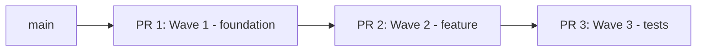

# Revisión y Creación de PR

> Revisa calidad, verifica leakage de AI scaffolding, evalúa tamaño, y opcionalmente crea el PR.

**Input:** `$ARGUMENTS` — número de PR a revisar, o "create" para crear uno nuevo

---

## Paso 1: Verificación de Leakage de Scaffolding (BLOQUEANTE)

| Patrón | Descripción |
|---------|-------------|
| `ai_docs/**` | Documentos de tareas, referencias |
| `.claude/**` | Commands, agents, skills |
| `.cursor/**` | Reglas de codificación IDE |
| `task_template*` | Archivos de plantilla de tarea |
| `NNN_*.md` (prefijo 3 dígitos) | Docs de tracking de tareas |

**Detección según contexto:**
- PR existente: `gh pr diff <number> --name-only`
- Crear PR: `git diff origin/main...HEAD --name-only`
- En main: `git diff HEAD --name-only`

**Si se encuentra scaffolding:** DETENER. Remover con `git rm -r --cached <path>` o `git reset HEAD <path>`. No proceder hasta limpio.

---

## Paso 2: Evaluación de Tamaño

| Líneas Cambiadas | Clasificación | Recomendación |
|------------------|---------------|---------------|
| 1-100 | Pequeño | Revisar tal cual |
| 101-300 | Mediano | Asegurar commits lógicos |
| 301-500 | Grande | Considerar dividir |
| 500+ | Muy Grande | WARNING — recomendar dividir |

---

## Paso 3: Escaneo de Calidad

1. **Código muerto:** Funciones vacías, imports no usados, código comentado
2. **Seguridad:** Secrets hardcoded, API keys expuestos, SQL injection
3. **Type safety:** Tipos `any`/`Any`, return types faltantes
4. **Error handling:** Cláusulas except vacías, errores tragados
5. **Arquitectura:** Imports mixtos server/client, prop drilling innecesario

**Formato de reporte:**
```
BLOCKING: [cantidad] issues (corregir antes de merge)
WARNING: [cantidad] issues (deberían corregirse)
CLEAN: [cantidad] áreas pasaron
```

---

## Paso 4: Acción

**Número de PR** → `gh pr view/diff <number>` → Pasos 1-3 → publicar resumen

**"create"** → Pasos 1-3 en rama actual → si pasa:
```bash
gh pr create --title "<type>: <description>" --body "$(cat <<'EOF'
## Resumen
- [cambios en bullet points]

## Plan de Pruebas
- [ ] [cómo testear]
EOF
)"
```
Reportar URL al usuario.

**Sin argumentos** → Pasos 1-3 en cambios actuales → preguntar: "¿Crear PR? ¿Push? ¿Corregir problemas primero?"

---

## Paso 5: Estrategia de Stacking (activación condicional, T081)

> Versión ligera del patrón de `gentle-ai/skills/chained-pr/SKILL.md` (376 líneas → ~70 líneas). NO replica diff hygiene exhaustivo ni reviewer guidance — `reviewer` cubre review post-impl.

**Cuándo se activa este sub-flow:**
- El task doc en curso (`ai_docs/tasks/NNN_*.md`) declara `> **Depende de:**` con 1+ IDs (T079), O
- "Tamaño estimado" en "Impactos esperados" excede 400 líneas (T080), O
- El usuario explícitamente pide "abrir cadena de PRs" o "split en stacked PRs".

**Cuándo NO se activa:**
- Tarea aislada sin dependencias declaradas y forecast ≤400 → flujo PR estándar (Pasos 1-4 sin esta sección).

### 5.1 — Decisión de strategy (preguntar UNA vez por sesión)

Si `ai_docs/STATE.md` tiene `pr_strategy: <stacked|feature_chain|exception>` cacheado, reusar. Si no, preguntar al usuario:

```
Esta tarea requiere cadena de PRs. ¿Qué estrategia?

1. Stacked PRs to main — cada PR mergea a main en orden. Rápido, fix-on-the-go.
   Mejor para: equipos que priorizan velocidad, slices independientes.

2. Feature Branch Chain (con tracker) — child PRs sobre rama padre; tracker PR
   acumula la feature y mergea a main al final. Mejor rollback.
   Mejor para: control de integración, releases coordinadas.

3. size:exception — un solo PR grande con aprobación explícita.
   Mejor para: código generado, migraciones, vendor diffs.
```

Cachear respuesta en `ai_docs/STATE.md` campo `pr_strategy`. NO volver a preguntar en waves siguientes.

### 5.2 — Diagrama Mermaid de la cadena

Tomar las waves de task-planner (T079) y renderizar:



Marcar el PR actual con etiqueta visible.

### 5.3 — Bloque "Chain Context" en el PR body

Añadir al `--body` (ANTES del Test Plan):

```markdown
## Chain Context

| Field | Value |
|-------|-------|
| Chain | <feature name> |
| Tracker PR | <#NNN o "N/A si stacked"> |
| Position | <N de M> |
| Base | `<branch>` |
| Depende de | <PR/issue o "None"> |
| Follow-up | <next PR o "None"> |
| Review budget | <changed lines> / 400 |

### Chain Overview
<diagrama Mermaid del 5.2>

### Autonomy
- [ ] CI verde para esta rama
- [ ] Un único deliverable
- [ ] Rollback aislado posible
- [ ] Tests/docs cubren esta unidad
```

### 5.4 — Comandos `gh` con bases correctas

| Strategy | Comando |
|---|---|
| **Stacked PRs to main** | `gh pr create --base main --head <wave_branch>`. Tras merge de PR N, retargetear PR N+1 a main y rebase. |
| **Feature Branch Chain** | PR 1: `gh pr create --base feat/<feature> --head <child_branch>`. PR N (N>1): `gh pr create --base <branch_de_PR_N-1> --head <child_branch>`. Tracker PR `feat/<feature> → main` en `--draft` hasta cierre. |
| **size:exception** | PR único, justificar tamaño en `--body`: `> **size:exception:** <razón>`. |

### 5.5 — Anti-patterns

- Mezclar strategies dentro de la misma cadena.
- Crear child PR sin diagrama del Paso 5.2.
- Mergear tracker PR antes de cerrar todos los child PRs (Feature Branch Chain).
- Apuntar child PRs a `main` cuando se eligió Feature Branch Chain → diff inflado con cambios de PRs anteriores.
- Re-preguntar strategy en wave 2+ si ya está cacheada en STATE.md.

---

## Reglas

1. **Verificación de scaffolding SIEMPRE primero** — sin excepciones
2. **Nunca crear PR con archivos de scaffolding**
3. **Presentar revisión antes de crear** — el usuario aprueba
4. **Código muerto se elimina**, no se documenta con TODOs
